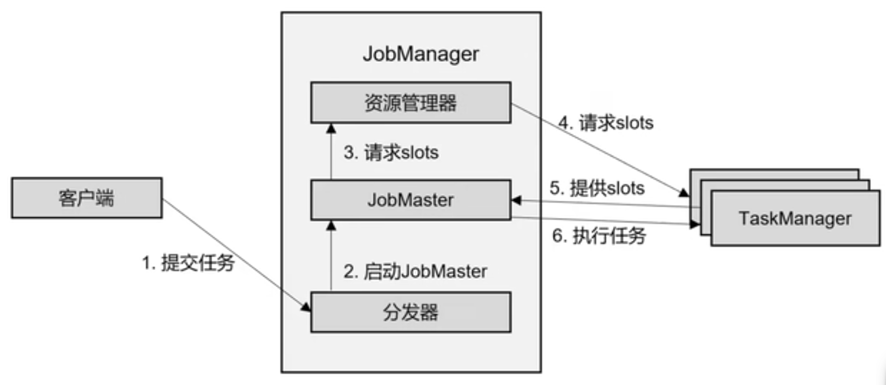
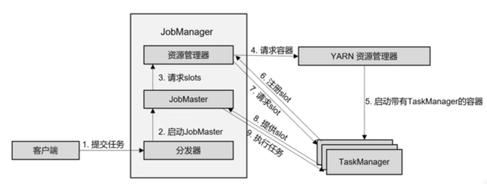
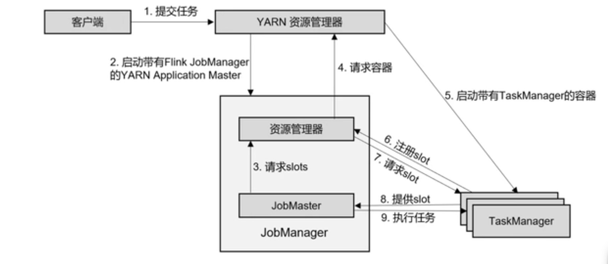

## 客户端

客户端向JobManager提交：jar包、数据流图、作业图(JobGraph)  

## JobManager

JobManager包括四个组件：JobMaster、ResourceManager、Dispatcher  
JobMaster是JobManager的核心组件，负责处理作业，把JobGraph转换为执行图(ExecutionGraph)
JobManager向ResourceManager申请资源，给TaskManager分发执行图。
JobMaster负责checkpoint协调

ResourceManager分配资源，分配的是TaskManager的task slot  
Dispatcher提供rest接口，用来提交应用

standalone session模式作业提交流程：

yarn session模式作业提交流程:

yarn per-job模式作业提交流程：

## 算子链

flink的任务链优化技术：并行度相同、并且是one-to-one操作可以合并成一个task  
disableChain 成为单独一个算子，不合并  
startChain 起一个新算子，不跟前面合并，可以跟后面合并  
slotSharingGroup("1") 共享的slot组名叫1  
可以结合执行图来理解算子链  

## Task和Slot

两个slot可以跑五个Task  
numberOfTaskSlots 推荐填cpu核心数  
