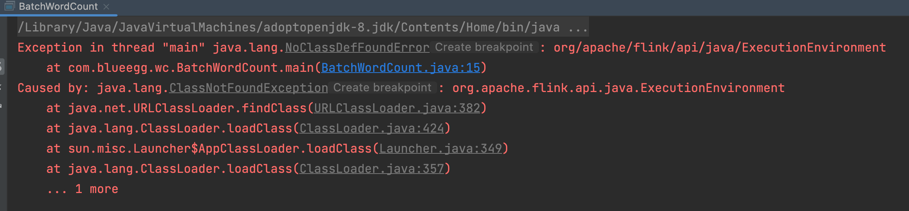
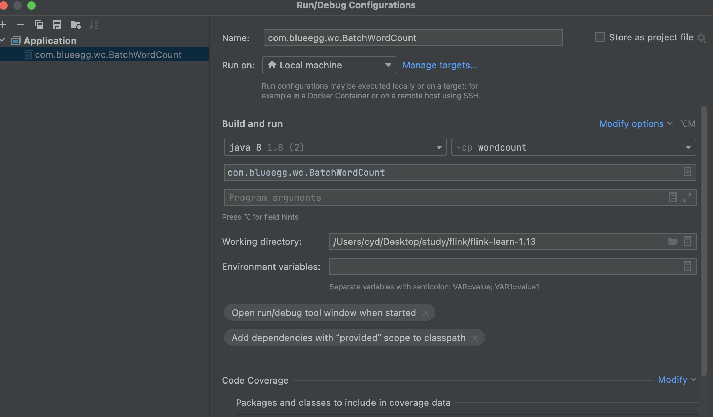

# wordcount

## 快捷键

psm  创建main函数  
env.readTextFile("input/words.txt").var 自动联想返回类型

## fix issue

  
默认引入的pom不是compile，会报找不到路径的错误，最佳实践是设置Include Dependencies with Provided scope。  
但是idea新版本界面变化了，现在在： Run-Edit configuation-modify option-Include Dependencies with Provided scope
  

找不到words.txt  
默认根路径是父目录，有子module情况下要加module路径  
